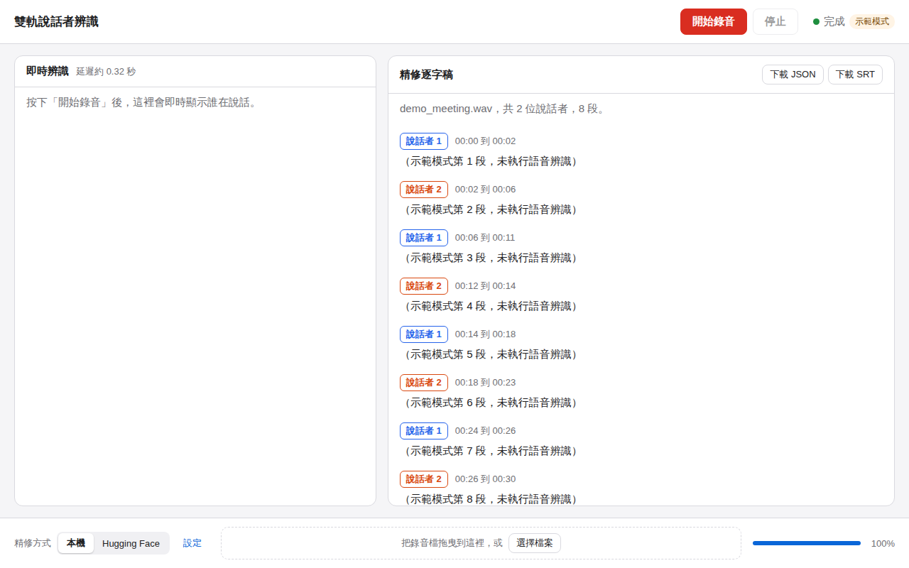

# 雙軌說話者辨識（Dual-Track Diarization App）

在 MacBook Air 上錄音，即時看到「誰在什麼時候說話」；停止後自動在背景精修，產出附說話者與時間的逐字稿。

- **軌道 A（即時）**：約 0.32 秒延遲的串流說話者辨識，錄音時即時顯示在左側。
- **軌道 B（精修）**：同一個模型改用約 30 秒延遲的高準確度設定，加上語音轉文字，結果顯示在右側，並校正即時結果的誤差。
- **精修方式可切換**：「本機」（Mac 的 MPS 加速，完全離線）或「Hugging Face」（上傳到雲端處理，較省電）。

模型：[`nvidia/Nemotron-3-Diarization`](https://huggingface.co/nvidia/Nemotron-3-Diarization)（OpenMDW-1.1，可商用）。語音轉文字：faster-whisper，並用 OpenCC 轉成台灣繁體中文。



## 給一般使用者：安裝與使用

需要：Apple Silicon 的 Mac（M1 以上）、macOS 12.3 以上、[Node.js LTS](https://nodejs.org)。

1. 打開「終端機」，進到這個資料夾，執行：
   ```bash
   scripts/setup_mac.sh
   ```
   第一次會安裝 Python 3.11、所需套件並下載模型，約需 10 到 20 分鐘。完成後，本機模式不需要網路。
2. 打包成 App（產生 `.dmg` 安裝檔）：
   ```bash
   scripts/build_app.sh
   ```
   第一次開啟 App 時，若 macOS 提示「無法驗證開發者」，請在 App 上按右鍵選「打開」。第一次錄音時請允許使用麥克風。
3. 不想打包也可以直接用瀏覽器試用：
   ```bash
   scripts/start_browser.sh          # 使用真正的模型
   scripts/start_browser.sh --demo   # 示範模式，不需要模型，可先看看介面
   ```

### 操作方式

| 想做的事 | 操作 |
| --- | --- |
| 錄一場會議 | 按「開始錄音」，左側即時顯示說話者；按「停止」後右側自動產出精修逐字稿 |
| 處理現有錄音檔 | 把檔案拖到下方虛線框，或按「選擇檔案」（WAV 最穩定；MP3、M4A 需先安裝 ffmpeg） |
| 切換本機或雲端 | 下方「精修方式」切換「本機」或「Hugging Face」 |
| 匯出結果 | 完成後按「在 Finder 中顯示」（瀏覽器版為「下載 JSON／下載 SRT」） |

使用電池時，App 會建議改用 Hugging Face 以節省電力；接上電源時建議用本機。

### 輸出格式

每次精修會在 `~/Library/Application Support/DualTrackDiarization/results/<工作編號>/` 產生：

- `final_transcript.json`
  ```json
  [
    {"start": 192.0, "end": 198.5, "speaker": "SPEAKER_00", "text": "我們先確認預算"},
    {"start": 198.5, "end": 202.1, "speaker": "SPEAKER_01", "text": "我這邊沒問題"}
  ]
  ```
- `final_transcript.srt`：字幕檔，每行前面標示說話者
- `meta.json`：來源檔、使用的精修方式、長度、說話者清單

錄音原始檔存在同一個資料夾下的 `recordings/`。

## 隱私

- **本機模式**：音訊與文字都不會離開這台電腦。
- **Hugging Face 模式**：錄音會上傳到您設定的端點。使用前必須在「設定」中勾選同意；存取金鑰存放在 macOS 鑰匙圈，不會寫進設定檔或記錄檔。
- 程式不會把原始音訊寫進記錄檔。辨識引擎只接受本機（127.0.0.1）的連線。

## Hugging Face 模式設定

1. 到 Hugging Face 建立存取金鑰（Settings > Access Tokens），在 App 的「設定」中貼上。
2. 預設的端點網址是模型的 serverless 網址。**Hugging Face 不一定提供這個模型的 serverless 推論**；若出現「找不到這個端點」，請用本專案附的 `python-sidecar/hf_endpoint/`（`handler.py` 與 `requirements.txt`）建立一個自訂的 [Inference Endpoint](https://huggingface.co/inference-endpoints)，再把端點網址貼到設定中。這個 handler 會在雲端同時完成說話者辨識與語音轉文字，Mac 只負責上傳。

## 架構

```
[麥克風 / 錄音檔]
        |
   錄音工作階段（sounddevice，16 kHz 單聲道）
    /                     \
軌道 A                    軌道 B
即時串流 0.32 秒           寫入 WAV
    |                        |
WebSocket 推送             工作佇列（一次一個）
    |                        |
 左側即時面板              精修處理
                          /          \
                  本機（MPS）    Hugging Face（上傳）
                          \          /
                    faster-whisper 逐字 + 對齊
                             |
                   final_transcript.json / .srt
```

| 層 | 技術 |
| --- | --- |
| 介面 | Tauri 2 + React + TypeScript（Vite） |
| 辨識引擎 | Python 3.11 + FastAPI，由 Tauri 啟動並在關閉 App 時結束 |
| 說話者辨識 | NeMo `SortformerEncLabelModel` 串流模式，torch MPS（不支援的運算自動退回 CPU） |
| 語音轉文字 | faster-whisper（預設 `small`，int8，CPU） |

### 檔案結構

```
src/                     React 介面
  App.tsx                狀態機與主要流程
  appState.ts            IDLE / RECORDING_REALTIME / PROCESSING_OFFLINE / DONE / ERROR
  components/            LivePanel、RefinedPanel、BackendToggle、FileDrop、SettingsDialog
src-tauri/               Tauri 外殼（啟動與關閉 Python 辨識引擎、麥克風權限說明）
python-sidecar/
  main.py                FastAPI 入口
  config.py              所有設定，含兩組串流延遲參數
  audio_capture.py       麥克風錄音、WAV 寫入、分段轉檔
  recording.py           錄音工作階段，同時餵給軌道 A 與軌道 B
  realtime_diarizer.py   軌道 A 串流辨識
  offline_processor.py   軌道 B 工作佇列
  nemo_loader.py         載入模型並套用延遲參數
  asr.py                 faster-whisper 與繁體轉換
  alignment.py           逐字對齊、JSON 與 SRT 輸出
  backends/              local_backend、hf_backend、mock_backend
  hf_endpoint/           可部署到 Hugging Face Inference Endpoints 的 handler
  benchmark_long_audio.py 長音檔效能與記憶體測試
  tests/                 單元與 API 測試
scripts/                 安裝、打包、瀏覽器試用
```

### API

| 方法 | 路徑 | 說明 |
| --- | --- | --- |
| POST | `/start` | 開始錄音，回傳 `{session_id}` |
| POST | `/stop` | 停止錄音，回傳 `{session_id, wav_path, duration}` |
| WS | `/stream?session_id=` | 伺服器推送 `{type: "segments", segments: [{id, start, end, speaker}]}`；若以 `source: "client"` 開始，可由用戶端送出 16 kHz PCM16 音訊 |
| POST | `/diarize/offline` | `{file_path, backend: "local" \| "hf"}`，回傳 `{job_id}` |
| GET | `/status?job_id=` | `{state, progress, stage, result_path, ...}` |
| GET | `/result?job_id=` | 逐字稿 JSON |
| GET | `/export?job_id=&format=json\|srt` | 下載檔案 |
| POST | `/upload` | 上傳檔案（瀏覽器拖放用），回傳 `{file_path}` |
| GET/POST | `/settings`、`/settings/hf_token` | 精修方式、端點、上傳同意、金鑰 |
| GET | `/health`、`/system`、`/devices` | 狀態、是否使用電池、麥克風清單 |

## 開發

```bash
# Python 測試（示範模式，不需要模型）
cd python-sidecar
python -m venv .venv && .venv/bin/pip install -r requirements-dev.txt
.venv/bin/python -m pytest

# 前端
npm install
npm run build          # 型別檢查與打包
npm run tauri dev      # 開發模式啟動 App
```

可用環境變數調整：`DIARIZATION_MOCK=1`（示範模式）、`DIARIZATION_DEVICE`（`mps`、`cpu`）、`DIARIZATION_MODEL`（模型 ID 或 `.nemo` 路徑）、`ASR_MODEL`（例如 `large-v3-turbo`，較準但較慢）、`SIDECAR_PORT`、`HF_TOKEN`。

### 延遲參數

兩個軌道使用同一個模型，差別只在串流參數（單位是 0.08 秒的影格），定義在 `python-sidecar/config.py`：

| 軌道 | chunk_len | right_context | fifo_len | update_period | spkcache_len | 延遲 |
| --- | --- | --- | --- | --- | --- | --- |
| A 即時 | 3 | 1 | 188 | 144 | 188 | 0.32 秒 |
| B 精修 | 340 | 40 | 40 | 300 | 188 | 30.4 秒 |

數值取自 NVIDIA 串流 Sortformer 公開的建議設定。若 Nemotron-3-Diarization 模型卡建議不同數值，直接修改 `config.py` 即可。

### 驗證 1 小時音檔

```bash
cd python-sidecar
~/Library/Application\ Support/DualTrackDiarization/venv/bin/python benchmark_long_audio.py            # 自動產生 1 小時測試檔
~/Library/Application\ Support/DualTrackDiarization/venv/bin/python benchmark_long_audio.py 會議.wav   # 用自己的錄音
```

會顯示處理時間與記憶體峰值（目標 2 GB 以下）。長音檔的處理方式：轉檔每次讀 30 秒；說話者辨識使用模型的串流模式（分段處理並保留說話者快取，說話者編號在整段錄音中保持一致）；語音轉文字逐段解碼。

## 目前狀態與限制

- **已驗證**：Python 測試 20 項全數通過（對齊、轉檔、即時分段、完整 API 流程含 WebSocket 串流）；前端型別檢查與打包通過；Tauri 外殼可編譯；以瀏覽器在示範模式下完成「匯入檔案、精修、顯示結果」的完整流程；1 小時 44.1 kHz 立體聲檔在示範模式下處理完成，記憶體峰值 150 MB（不含模型）。
- **尚未在實機驗證**：開發環境無法連線到 Hugging Face，也沒有 Mac 或麥克風，所以**真正的模型推論、MPS 效能、麥克風錄音與 .dmg 打包都還沒實際跑過**。模型呼叫依照 NeMo 3.0 原始碼中的 `SortformerEncLabelModel.diarize` 與 `forward_streaming_step` 撰寫（即時部分參考 NeMo 官方 voice agent 的串流範例），第一次在 Mac 上執行時請留意終端機訊息。
- 模型約 1 億個參數。兩個軌道各自載入一份，約各佔 400 MB 記憶體；faster-whisper `small` 約 500 MB。
- 即時結果只有說話者與時間，沒有文字；文字在精修階段產生。
- 目前 App 需要先執行 `setup_mac.sh` 建立 Python 環境，Python 尚未打包進 `.dmg`。
